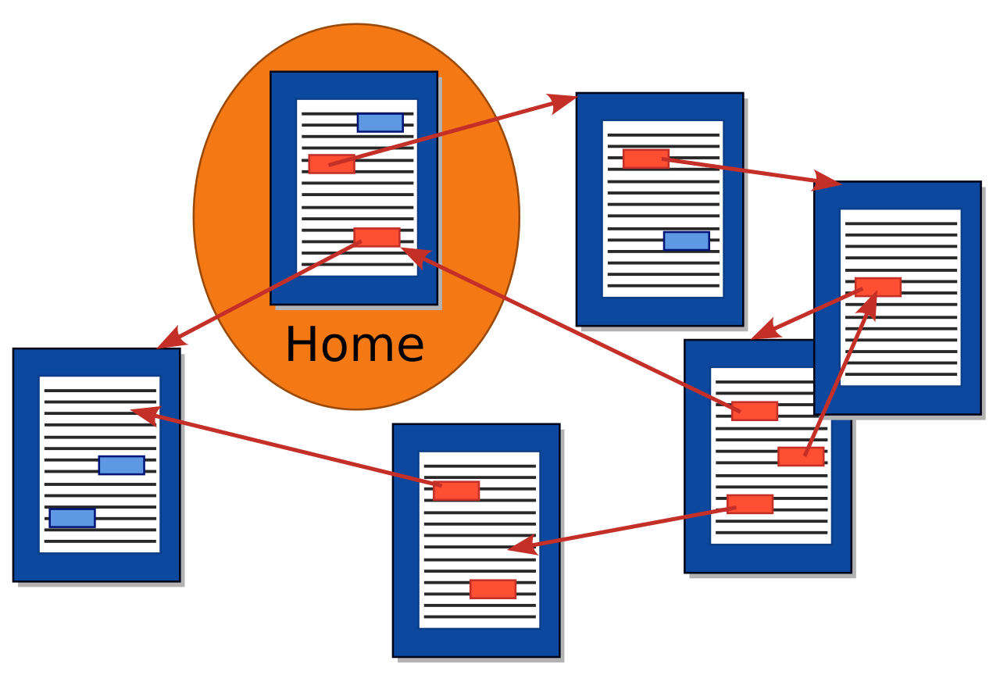

## 2. Hipertextul

---

### 2.1. 

Acest subcapitol prezinta o scurta istorie a Hipertextului (Hypertext) precum si nevoia acestuia de a fi inventat.

> Hypertext is text displayed on a computer display or other electronic devices with references (hyperlinks) to other text that the reader can immediately access. Hypertext documents are interconnected by hyperlinks, which are typically activated by a mouse click, keypress set, or screen touch.
> 
> [Wikipedia: Hypertext](https://en.wikipedia.org/wiki/Hypertext)


<p align="center">
  
</p>

*Sursa: [Wikipedia Hyperlinks_scheme](https://en.wikipedia.org/wiki/File:Hyperlinks_scheme.svg)*

Imaginea reprezinta conectarea dintre Hipertexte prin intermediul Hiperlinkurilor.

O colectie de "Hipertexte" poate fi reprezentata ca un graf orientat, ceea ce este logic si aduce a un WebScraper in care se colecteaza toate *link-urile* prezente pe pagina de web si se viziteaza urmatoarele (daca nu au fost vizitate deja).

Pentru a putea fi interpretate aceste Hipertexte, a fost folosita o interfata numita "browser", prin care "nodurile" (paginile) se puteau traversa.

> Nodul-sursă al unei legături se numește *referință*, iar cel destinație - *referent*. Nodurile conectate prin intermediul unei legături sunt denumite și *ancore*.(pag. 10)

In prezent se aude foarte des despre HTML (Hypertext Markup Language) ca limbaj de markup (si se spune destul de des ca nu reprezinta un limbaj de programare propriu-zis), totodata exista mai multe tipuri de astfel de limbaje de marcare:
- SGML (Standard Generalized Markup Language)
    - Necesita un DTD (Document Type Definition) pentru a declara ce etichete sunt permise si care este ierarhia lor
    - Status: Obsolet

```
<!DOCTYPE RAPORT [
<!ELEMENT RAPORT - - (TITLU, AUTOR, CONTINUT)>
<!ELEMENT TITLU - - (#PCDATA)>
<!ELEMENT AUTOR - - (#PCDATA)>
<!ELEMENT CONTINUT - - (#PCDATA)>
]>
<RAPORT>
  <TITLU>Analiza de Sistem</TITLU>
  <AUTOR>Departament IT</AUTOR>
  <CONTINUT>Verificarea parametrilor a fost finalizată cu succes.</CONTINUT>
</RAPORT>
```

- HTML (HyperText Markup Language)
    - Derivat initial din SGML 
    - Spre deosebire de SGML (unde dezvoltatorul creeaza propriile etichete), HTML vine cu un vocabular predefinit și standardizat de etichete (tag-uri) pe care browserele web știu să le interpreteze (ex. `<h1>` pentru titluri, `<p>` pentru paragrafe).
  
Exemplu HTML:
```html
<!DOCTYPE html>
<html>
<head>
    <title>Manual de Utilizare</title>
</head>
<body>
    <h1>Configurarea rețelei</h1>
    <p>Conectați cablul în portul marcat cu <strong>WAN</strong>.</p>
    <ul>
        <li>Pasul 1: Porniți routerul.</li>
        <li>Pasul 2: Așteptați semnalul luminos verde.</li>
    </ul>
</body>
</html>
```

- XML (eXtensible Markup Language)
    - Compromis între complexitatea extremă a SGML și rigiditatea HTML. Limbaj de marcare conceput exclusiv pentru stocarea și transportul datelor, nu pentru afișarea lor
    - Status: Destul de folosit, desi in dezvoltarea web moderna este inlocuit destul de mult de formatul JSON (JavaScript Object Notation)
    - Folosit in layout-urile aplicațiilor Android, configurări Java Spring și ca structură pentru alte formate de fișiere (ex. fișierele .docx din Microsoft Word sau grafica vectorială .svg care sunt teoretic fișiere XML arhivate).
Exemplu XML:
```xml
<?xml version="1.0" encoding="UTF-8"?>
<inventar>
    <produs id="1042">
        <nume>Placă de bază</nume>
        <categorie>Componente Hardware</categorie>
        <pret_unitar moneda="EUR">150.00</pret_unitar>
        <in_stoc>true</in_stoc>
    </produs>
</inventar>
```

- MHEG (Multimedia and Hypermedia information coding Expert Group)
    - Diferit fata de cele prezentate, nu se bazeaza pe paranteze unghiulare `<>`, ci defineste clase si obiecte (abordare orientata pe obiecte) pentru a prezenta continut interactiv
    - Status: Obsolet
Exemplu MHEG:
```
{:Scene ( "Meniu_Principal" 0 )
  :Items (
    {:Rectangle fundalMeniu
      :OrigBoxSize 720 576
      :OrigPosition 0 0
      :OrigRefFillColour COLOUR_BLUE
    }
    {:Text txtTitlu
      :OrigContent "Apăsați butonul ROȘU pentru opțiuni"
      :OrigPosition 50 100
      :TextColour COLOUR_WHITE
    }
  )
}
```

- HyTime (Hypermedia/Time-based Structuring Language)
    - Construit ca extensie a limbajului SGML. Numele reflectă scopul principal de a adăuga dimensiuni de timp (Time) și spațiu pentru conținutul multimedia și crea legături (Hypermedia) complexe.
    - Status: Obsolet

Exemplu HyTime: 
```
<!-- Exemplu de legătură contextuală (clink) bidirecțională -->
<referinta HyTime="clink" linkend="capitolul_4">
  Vezi detalii în secțiunea de mentenanță.
</referinta>

<!-- Exemplu de sincronizare temporală (Eveniment) -->
<programare_evenimente HyTime="evsched">
  <eveniment_media id="sunet_avertizare" start="00:00:10" durata="00:00:05" HyTime="event">
    <audio fisier="alerta.wav"></audio>
  </eveniment_media>
</programare_evenimente>
```

> A markup language is a text-encoding system which specifies the structure and formatting of a document and potentially the relationships among its parts.[1] Markup can control the display of a document or enrich its content to facilitate automated processing.
>
> *[Sursa: Wikipedia Markup language](https://en.wikipedia.org/wiki/Markup_language)*


### 2.2.

In marcarea hipertextului se vorbeste despre standardizarea reprezentarii pe Web a documentelor prin HTML. 

Totodata se exprima posibilitatea ca HTML sa fie inlocuit de XHTML. Nu am gasit nimic legat de acest gen cautand pe internet (dimpotriva mai multe surse mentioneaza ca XHTML ar deveni obsolet). Pagina urmatoare de w3schools arata diferente dintre XHTML si HTML https://www.w3schools.com/html/html_xhtml.asp .

Mai mult, HTML a trecut prin mai multe etape de dezvoltare, HTML 2.0, HTML 3.2, HTML 4.0 (si nu se mentioneaza HTML5, care a fost lansat in 2008).

Pentru dispozitive mobile miniaturizate, HTML este inlocuit de:
- HDML (Handheld Device Markup Language)
    - Asemănător cu HTML, dar mult mai simplificat
    - Status: Obsolet
Exemplu de HDML:
```
<HDML VERSION=1.0>
  <!-- Prima carte din pachet (Afișare text și un buton de acțiune) -->
  <DISPLAY NAME="ecran_start">
    <ACTION TYPE=ACCEPT LABEL="Urmatorul" GO="#ecran_detalii">
    Bine ați venit în rețeaua mobilă!
  </DISPLAY>

  <!-- A doua carte din pachet -->
  <DISPLAY NAME="ecran_detalii">
    Semnalul este optim. Nu sunt mesaje noi.
  </DISPLAY>
</HDML>
```
- WML (Wireless Markup Language)
    - Evoluția standardizată a HDML. Creat de Wap Forum
    - Status: Obsolet
Exemplu de WML:
```
<?xml version="1.0"?>
<!DOCTYPE wml PUBLIC "-//WAPFORUM//DTD WML 1.1//EN" "http://www.wapforum.org/DTD/wml_1.1.xml">
<wml>
  <!-- Definirea primei cărți -->
  <card id="meniu" title="Portal WAP">
    <p>
      Știri de ultimă oră:<br/>
      <!-- Legătură către a doua carte din același pachet -->
      <a href="#vremea">Meteo</a><br/>
      <a href="http://exemplu.com/sport.wml">Sport</a>
    </p>
  </card>

  <!-- Definirea celei de-a doua cărți -->
  <card id="vremea" title="Vremea Azi">
    <p>
      București: 24 Grade Celsius, parțial înnorat.
    </p>
  </card>
</wml>
```

Prin rigiditate, se intelege faptul ca nu accepta nicio eroare de sintaxa, daca lipseste o singura paranteza programul refuza sa fie citit si genereaza o eroare. In schimb, HTML incearca sa intuiasca intentia programatorului, afisand pagina chiar daca exista elemente uitate sau scrise gresit.

Pentru a infrumuseta afisarea informatiilor, au fost adaugate *foile de stiluri in cascada* (CSS - Cascading Style Sheet), care se linkeaza cu fisierele HTML si permit schimbarea atributelor fiecarui tag in parte.


