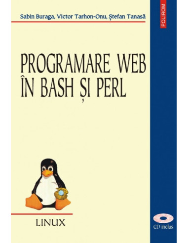

# ProgramareWeb_Bash_Perl
Analiză asupra cărții "Programare Web în bash și Perl" scrisă de Sabin Buraga, Victor Tarhon-Onu și Ștefan Tanasă.

---

    

## Cuprins

Cuvânt înainte (dr.ing. Dan Grigoraș)
Prefață

Capitolul 1 - Tehnologiile Web pe scurt
1. Introducere
2. Hipertextul - **_[link către analiza subcapitolului](./Capitolul_1/2_Hipertextul.md)_**
    * 2.1. Definiție și structură
    * 2.2. Marcarea hipertextului
3. Protocolul HTTP
    * 3.1. Preliminarii
    * 3.2. Conceptele de funcționare
    * 3.3. Identificatori uniformi de resurse (URI)
    * 3.4. Codificarea conținutului
    * 3.5. Mesaje HTTP
    * 3.6. Conexiunile HTTP
    * 3.7. Atributele HTTP
4. Limbajele de marcare și aplicațiile lor
    * 4.1. Caracterizare
    * 4.2. Ce este XML?
    * 4.3. Structura documentelor XML
    * 4.4. Declarația tipului de documente
    * 4.5. Spații de nume
    * 4.6. Scheme XML
    * 4.7. De la HTML la XML
    * 4.8. Procesarea documentelor XMl
5. Exerciții propuse

Capitolul 2 - Standardul CGI
1. CGI (Common Gateway Interface)
    * 1.1. Scripturi CGI
    * 1.2. Variabile de mediu disponibile unui script CGI
    * 1.3. Apelarea programelor CGI în formularele Web
2. SSI (Server Side Includes)
3. Cookie-uri
    * 3.1. Prezentarea generală
    * 3.2. Atributele unui cookie
    * 3.3. Stocarea cookie-urilor

Capitolul 3 - Bash
1. Caracterizare
2. Comenzi
    * 2.1. Posibilități de ajutor
    * 2.2. Funcționalități de bază
    * 2.3. Comenzi utile
    * 2.4. Redirecționarea intrărilor și ieșirilor
    * 2.5. Mecanismul *pipe*
3. Programarea în bash
    * 3.1. Scripturi bash
    * 3.2. Variabile
    * 3.3. Instrucțiuni
    * 3.4. Comanda `test`
    * 3.5. Scripturi sistem
    * 3.6. Exemple
4. Scripturi CGI în bash
    * 4.1. Primele scripturi în CGI
    * 4.2. Generarea de conținut dinamic
    * 4.3. Interacțiunea cu utilizatorul
    * 4.4. Utilizarea bibliotecii `bashlib`
5. Exerciții propuse

Capitolul 4 - Limbajul Perl
1. Prezentare a limbajului Perl
    * 1.1. Generalități
    * 1.2. Disponibilitate și documentații
    * 1.3. Trecere în revistă a limbajului
    * 1.4. Expresii regulate
    * 1.5. Modulele Perl
2. Scripturi CGI în Perl
    * 2.1. Primele scripturi CGI
    * 2.2. Modulul CGI
    * 2.3. Exemple de scripturi
3. Perl și bazele de date relaționale
    * 3.1. Modulul DBI
    * 3.2. Operații uzuale asupra bazelor de date
    * 3.3. Tratarea erorilor
    * 3.4. Exemple
4. Prelucrarea documentelor XML
    * 4.1. Utilizarea analizatorului Expat
    * 4.2. Utilizarea modelului DOM
    * 4.3. Alte module
5. Studii de caz
    * 5.1. Interogarea via Web a unei baze de date MySQL
    * 5.2. Realizarea unei aplicații de inventar folosind PostgreSQL
    * 5.3. Aplicație Web de monitorizare a calculatoarelor
    * 5.4. Migrarea de la baze de date relaționale la documente XML
6. Exerciții propuse

Capitolul 5 - Proiecte propuse

Anexa - Funcțiile Perl predefinite

---

### Credit Bibliografic și Sursă Originală

Toate drepturile de autor asupra textului original, a metodologiei didactice și a scripturilor demonstrative tipărite în volum aparțin în totalitate autorilor și editurii. Informațiile prezentate în acest repository sunt exclusiv derivate din studiul următoarei cărți/lucrări:

*   **Titlu:** Programare web în bash și perl
*   **Autori:** Sabin Buraga, Victor Tarhon-Onu, Ștefan Tanasă
*   **Editură:** Editura POLIROM, Iași
*   **An apariție:** 2002
*   **ISBN:** 973 683 931 1
*   **Copyright:** © 2002 by Editura POLIROM

---

### Notă asupra copyright (Disclaimer)
Acest repository reprezintă mai mult o parcurgere a acesteia (sub formă de recenzie asupra utilității informației în momentul actual).

* **NU** voi folosi paragrafe de cod sau explicații.
* **NU** voi copia schemele folosite în carte în mod exact.

Materialele incluse în acest repository (explicații, rezumate de capitole, opinii critice) sunt redactate integral cu formulări proprii. Scripturile și exemplele de cod stocate aici reprezintă implementări scrise de la zero pentru a valida înțelegerea conceptelor din carte și nu constituie transcrieri ale codului original protejat de drepturi de autor. Lucrarea originală nu este reprodusă, distribuită sau copiată, acest proiect încadrându-se în limitele legale ale dreptului la recenzie și utilizare onestă în scop educațional.

În cazul în care proiectul încalcă în orice măsură drepturile de proprietate intelectuală deschideți un **Issue** în acest repository.